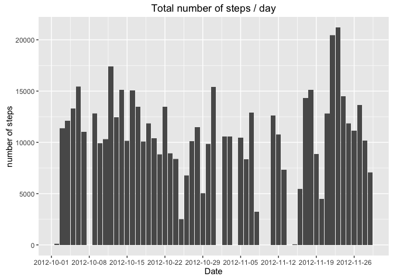
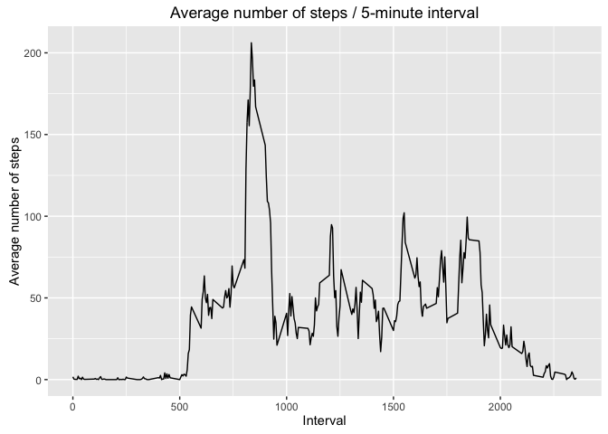
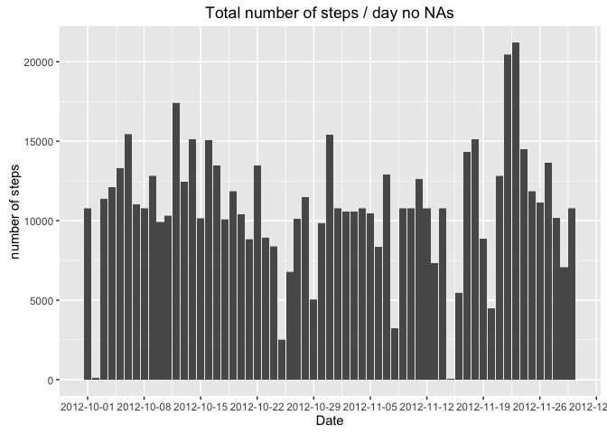
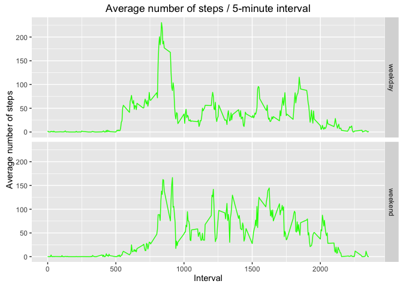

# Reproducible Research: Peer Assessment 1


## Loading and preprocessing the data


```r
assess_data = './activity.csv'
if(!exists(assess_data)) {
    unzip("activity.zip")
}

activity = read.csv("activity.csv")
```

## What is mean total number of steps taken per day?


```r
# load ggplot2
library(ggplot2)

step_plot = ggplot(activity)
print(
    step_plot + aes(x = as.Date(activity$date, "%Y-%m-%d"), y = activity$steps) +
        geom_bar(stat="identity") +
        scale_x_date(date_breaks = "1 week") +
        ggtitle("Total number of steps / day") +
        xlab("Date") +
        ylab("number of steps")
)
```

```
## Warning: Removed 2304 rows containing missing values (position_stack).
```

<!-- -->

```r
# aggregate will omit NA values
activity_sum = aggregate(steps ~ date, data=activity, FUN=sum)
```
### mean

```r
mean(activity_sum$steps)
```

```
## [1] 10766.19
```
There is an average of 10766.19 steps per day.  
### median

```r
median(activity_sum$steps)
```

```
## [1] 10765
```
The median of steps per day is 10765 which is really close to the mean.  


## What is the average daily activity pattern?


```r
activity_mean = aggregate(steps ~ interval, data=activity, FUN=mean)
ts = ggplot(activity_mean)
print(
    ts +
        aes(x = interval, y = steps) +
        geom_line() +
        ggtitle("Average number of steps / 5-minute interval") +
        xlab("Interval") +
        ylab("Average number of steps")
)
```

<!-- -->


```r
max_steps_avg = max(activity_mean$steps)
activity_mean[activity_mean$steps == max_steps_avg, ]
```

```
##     interval    steps
## 104      835 206.1698
```
The interval **835** contains the maximum number of steps with an average of : **206.1698** steps.


## Imputing missing values


```r
# sum of NAs rows
sum(is.na(activity))
```

```
## [1] 2304
```
There are **2304** missing values which correspond to **8 days** (2304 / 288, 288 being the number of intervals per day). The missing days are visible on the "*histogram of the total number of steps taken each day*".  

We will feel the missing data with the mean for the corresponding 5-minute intervals as the missing values are complete days, we will not be able to compute the mean for the day.  


```r
activity2 <- activity
for (i in 1:nrow(activity2)) {
     if (is.na(activity2$steps[[i]])) {
         activity2$steps[[i]] <- activity_mean$steps[activity_mean$interval == activity2$interval[i]]
     }
 }
```


```r
step_plot2 = ggplot(activity2)
print(
    step_plot2 + aes(x = as.Date(activity2$date, "%Y-%m-%d"), y = activity2$steps) +
        geom_bar(stat="identity") +
        scale_x_date(date_breaks = "1 week") +
        ggtitle("Total number of steps / day no NAs") +
        xlab("Date") +
        ylab("number of steps")
)
```

<!-- -->

```r
#MEAN AND MEDIAN
activity_sum2 = aggregate(steps ~ date, data=activity2, FUN=sum)
# mean 
mean(activity_sum2$steps)
```

```
## [1] 10766.19
```

```r
# median
median(activity_sum2$steps)
```

```
## [1] 10766.19
```

The mean is the same as the original dataset which seems pretty logic as the mean values for each interval have been used to fill the NA values.  
The median is now equal to the mean but actually does not differ much from the previous value.  


## Are there differences in activity patterns between weekdays and weekends?


```r
activity2$dayType <- weekdays(as.Date(activity2$date))
activity2$dayType[activity2$dayType == 'Sunday'] <- 'weekend'
activity2$dayType[activity2$dayType == 'Saturday'] <- 'weekend'
activity2$dayType[activity2$dayType != 'weekend'] <- 'weekday'
activity2$dayType <- as.factor(activity2$dayType)
```


```r
activity2_mean = aggregate(steps ~ interval + dayType, data=activity2, FUN=mean)
ts = ggplot(activity2_mean)
print(
    ts +
        aes(x = interval, y = steps) +
        geom_line(colour='green') +
        facet_grid(dayType ~ .) +
        
        ggtitle("Average number of steps / 5-minute interval") +
        xlab("Interval") +
        ylab("Average number of steps")
)
```

<!-- -->

